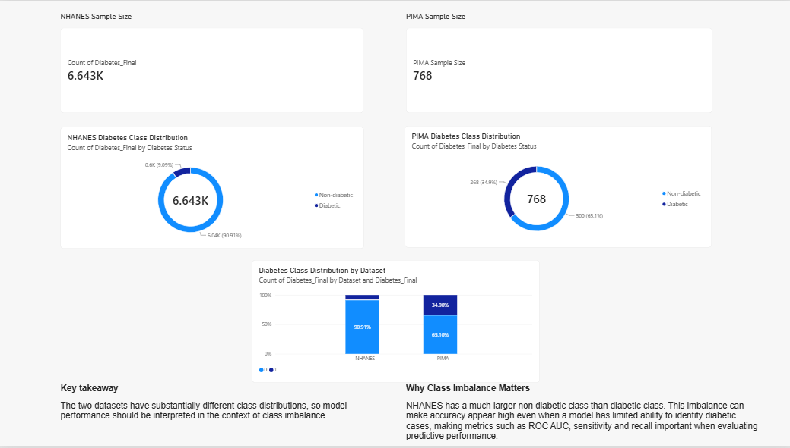
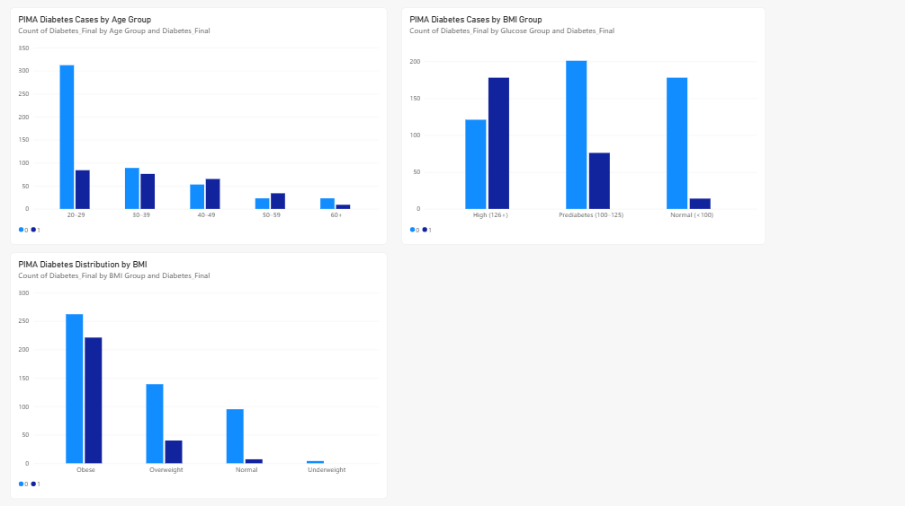
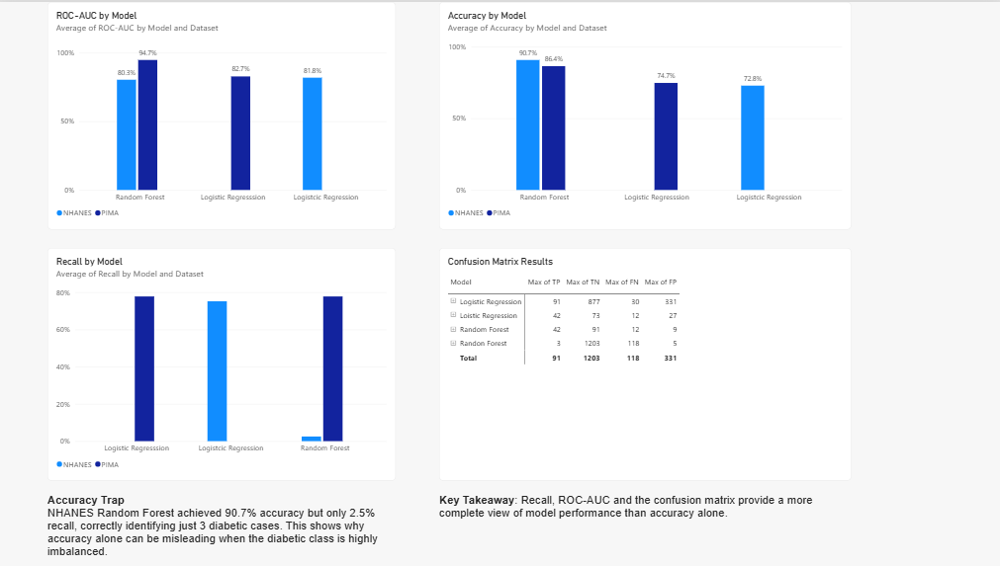
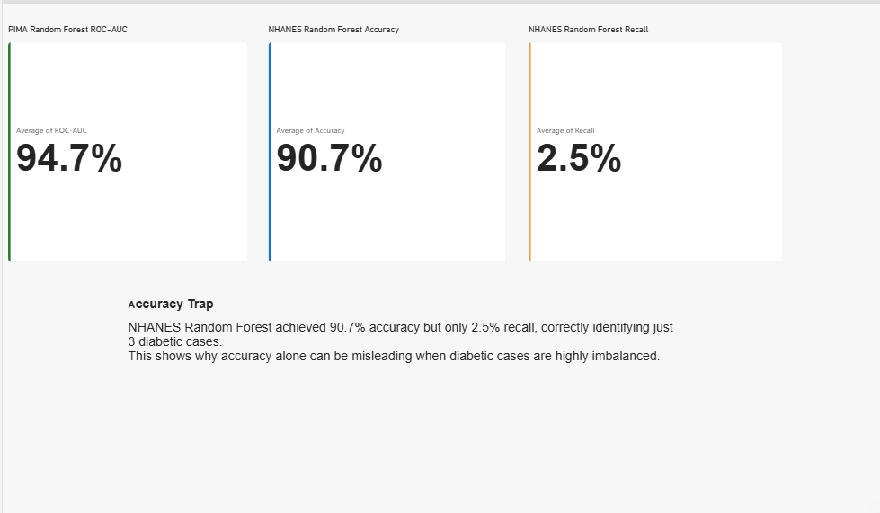

# Preventive Healthcare Risk Prediction

A data science and business intelligence project exploring how predictive analytics can support earlier identification of diabetes risk using two different healthcare datasets: **PIMA** and **NHANES**.

The project combines Python-based machine learning with Power BI visual analytics to compare model behaviour across populations with different class distributions and demonstrate why accuracy alone can be misleading in healthcare prediction.

## Project Overview

The analysis explores:

- How routinely collected health indicators can support diabetes classification
- How Logistic Regression and Random Forest perform across different datasets
- How class imbalance affects model evaluation
- Why multiple evaluation metrics matter in preventive healthcare

## Data

### PIMA

- 768 observations
- 268 diabetic cases
- 34.9% positive class

### NHANES

- 6,643 observations after preparation
- 604 diabetic cases
- 9.1% positive class

The substantial difference in class distribution provides a useful comparison for understanding how predictive models behave when the positive class is relatively rare.

> Raw and participant-level datasets are intentionally excluded from this repository.

## Dataset Overview

NHANES is considerably more imbalanced than PIMA, which directly affects how model accuracy should be interpreted.

## Analytical Workflow

1. Data preparation and cleaning
2. Missing-value handling
3. Descriptive analysis
4. Stratified 80/20 train-test split
5. Logistic Regression modelling
6. Random Forest modelling
7. Multi-metric evaluation
8. Power BI visualisation and interpretation

Balanced class weighting was used during model training to reduce majority-class dominance.

## Risk Factor Analysis

The descriptive analysis explores aggregate patterns across variables such as age, BMI and glucose before predictive modelling.

## Model Performance

### Key Results

| Dataset | Model | ROC-AUC | Accuracy | Recall |
| --- | --- | ---: | ---: | ---: |
| PIMA | Random Forest | 94.7% | 86.4% | 77.8% |
| PIMA | Logistic Regression | 82.7% | 74.7% | 77.8% |
| NHANES | Random Forest | 80.3% | 90.7% | 2.5% |
| NHANES | Logistic Regression | 81.8% | 72.8% | 75.2% |

One of the most important findings appears in the NHANES results.

Random Forest achieved **90.7% accuracy**, but recall was only **2.5%**. Logistic Regression produced lower accuracy at **72.8%**, while recall increased to **75.2%**.

## The Accuracy Trap

This demonstrates an important problem in imbalanced classification:

> A model can appear highly accurate while failing to identify most positive cases.

For preventive healthcare applications, recall, ROC-AUC, F1 score and confusion matrices should therefore be evaluated alongside accuracy.

## Tools

- Python
- Pandas
- NumPy
- Scikit-learn
- Matplotlib
- Google Colab
- Power BI

## Repository Structure

- `images/` — dashboard screenshots and aggregate visualisations
- `notebooks/` — reproducible Python analysis
- `data/raw/` — local source datasets, excluded from Git
- `data/processed/` — local processed datasets, excluded from Git
- `results/` — safe aggregate model outputs
- `src/` — reusable project code
- `requirements.txt` — Python dependencies

## Running the Analysis

Install the dependencies with:

`pip install -r requirements.txt`

Place the required source datasets inside:

`data/raw/`

Then open:

`notebooks/preventive_healthcare_analysis.ipynb`

and run the notebook.

## Privacy and Responsible Use

This repository intentionally excludes:

- participant-level datasets
- participant identifiers
- personal or identifying information
- raw Power BI data models
- academic submission documents

Only aggregate analytical results and non-identifying visualisations are included.

## Disclaimer

This project demonstrates machine-learning and analytical behaviour using historical public datasets. It is **not a clinical diagnostic tool** and should not be used to make medical decisions.
